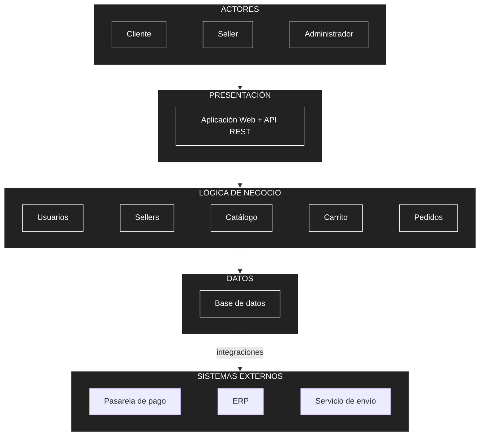
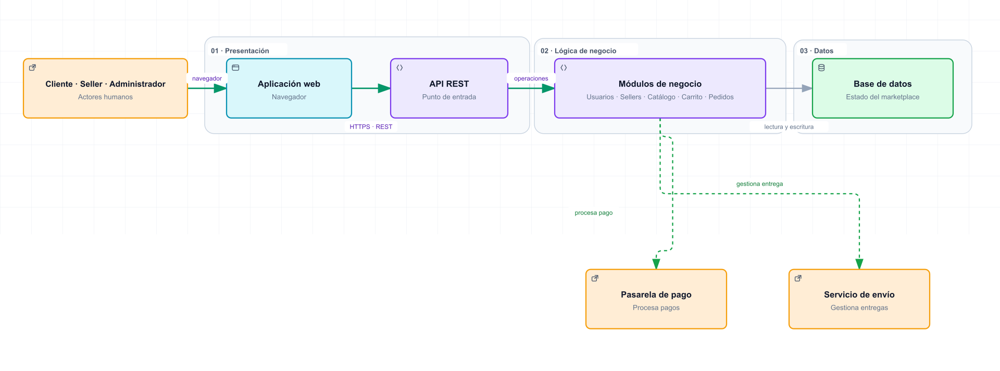

# Arquitectura inicial del marketplace de productos para mascotas

> Propuesta de diseño en tres capas para el Laboratorio 02.

## Diagrama de arquitectura

### Vista gráfica (Archify)

[**Abrir el diagrama interactivo original de Archify**](./arquitectura-inicial.html)

## Descripción

- **Presentación:** la aplicación web permite interactuar a Cliente, Seller y Administrador; la API REST recibe las solicitudes.
- **Lógica de negocio:** Usuarios, Sellers, Catálogo, Carrito y Pedidos separan las funciones principales del marketplace.
- **Datos:** la base de datos almacena y permite consultar la información del sistema.
- **Sistemas externos:** Pedidos se integra con la pasarela de pago y el servicio de envío. El ERP puede aportar información de productos y stock al Catálogo.
