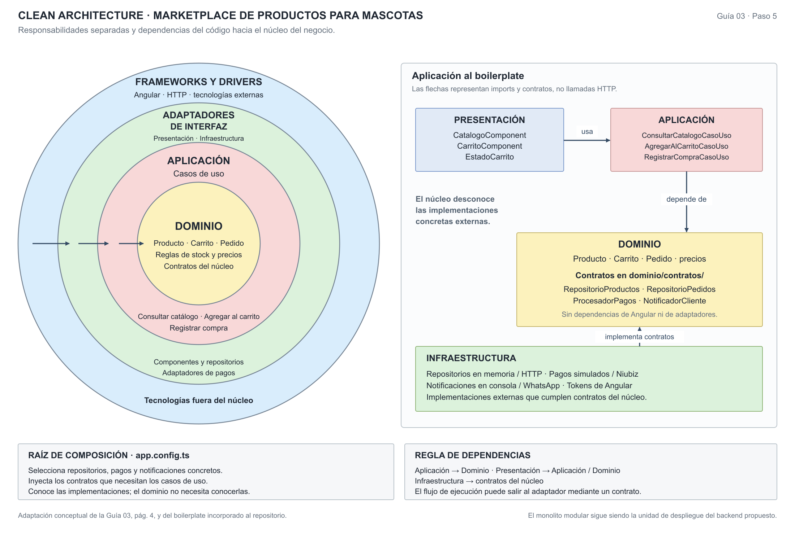
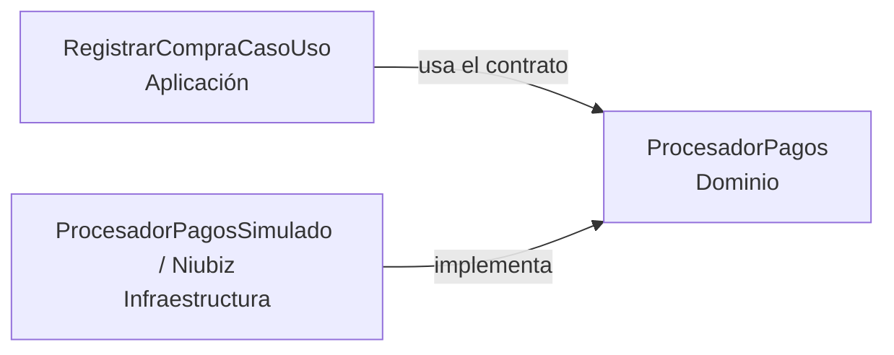

# Enfoque arquitectónico: Clean Architecture

## 1. Enfoque seleccionado

Se selecciona **Clean Architecture (Arquitectura Limpia)** para separar las reglas del negocio de la interfaz de usuario y los detalles tecnológicos. Esta decisión corresponde a **ADR-002** y responde principalmente a **DA06 – Mantenibilidad**, además de facilitar **ADR-004 – Integración de pagos mediante contratos y adaptadores**.

El monolito modular del paso 4 define la unidad de despliegue del backend y sus módulos. Clean Architecture define qué responsabilidades pertenecen al núcleo y qué dependencias se permiten dentro de esos módulos. Se aplican conjuntamente: los módulos no necesitan desplegarse como microservicios para separar sus reglas de la infraestructura.

| Elemento              | Descripción aplicada al marketplace                                                                                 |
| :-------------------- | :------------------------------------------------------------------------------------------------------------------ |
| Patrón / enfoque      | Clean Architecture.                                                                                                 |
| Objetivo              | Separar responsabilidades y orientar las dependencias de código hacia el dominio y los casos de uso.                |
| Problema que resuelve | Evitar que las reglas del negocio queden acopladas a Angular, a la persistencia o a un proveedor concreto de pagos. |
| Capas definidas       | Dominio, Aplicación, Presentación e Infraestructura.                                                                |
| Beneficios            | Facilitar el mantenimiento, las pruebas del núcleo y el reemplazo de adaptadores que cumplen el mismo contrato.     |

## 2. Responsabilidades por capa

La distribución se relaciona con los archivos existentes en `boilerplate/src/app/`. Estos ejemplos son evidencia del proyecto Angular de la guía; las integraciones de base de datos y envíos del backend siguen siendo parte de la propuesta.

| Capa                | Responsabilidad                                                                                    | Ejemplos existentes en el boilerplate                                                                                                                              |
| :------------------ | :------------------------------------------------------------------------------------------------- | :----------------------------------------------------------------------------------------------------------------------------------------------------------------- |
| **Dominio**         | Entidades, reglas de negocio y contratos independientes de la tecnología.                          | `Producto`, `Carrito`, `Pedido`; reglas de stock, precios e IGV; contratos `RepositorioProductos`, `RepositorioPedidos`, `ProcesadorPagos` y `NotificadorCliente`. |
| **Aplicación**      | Casos de uso que coordinan entidades y solicitan operaciones mediante contratos.                   | `ConsultarCatalogoCasoUso`, `AgregarAlCarritoCasoUso` y `RegistrarCompraCasoUso`.                                                                                  |
| **Presentación**    | Pantallas, interacción del usuario y estado de la interfaz. Delega operaciones a los casos de uso. | `CatalogoComponent`, `CarritoComponent` y `EstadoCarrito`. En el backend propuesto, incluye rutas y controladores de la API.                                       |
| **Infraestructura** | Implementaciones concretas de repositorios, pagos, notificaciones y mecanismos tecnológicos.       | Repositorios en memoria y HTTP; pagos simulados y adaptador Niubiz; notificador de consola y adaptador WhatsApp; tokens de inyección de Angular.                   |

Los contratos del ejemplo están en **`dominio/contratos/`**. La tabla conceptual de la guía también permite ubicar puertos en Aplicación: su ubicación depende del diseño. Aquí se conserva la estructura real del boilerplate. Lo esencial es que el contrato esté en el núcleo y su implementación tecnológica afuera.

## 3. Gráfica del enfoque



[SVG editable](./diagrama-enfoque-arquitectonico.svg) · [PNG](./diagrama-enfoque-arquitectonico.png) · [PDF](./diagrama-enfoque-arquitectonico.pdf)

Los círculos adaptan la representación conceptual de la página 4 de la guía. El panel de dependencias muestra cómo se aplica al boilerplate. **Las flechas indican dependencias del código**, no la secuencia temporal de una compra ni llamadas HTTP.

Los círculos conceptuales no equivalen a una carpeta cada uno: Presentación contiene adaptadores de interfaz; Infraestructura agrupa adaptadores concretos y mecanismos de frameworks. Ambas quedan fuera del núcleo de Dominio y Aplicación.

## 4. Regla de dependencias

El código del núcleo no conoce las implementaciones externas. Una clase de Aplicación puede importar una entidad o un contrato de Dominio; no debe importar Angular, `HttpClient`, un repositorio concreto ni un proveedor de pagos.

| Dependencia de código                                 | Regla en esta propuesta                                                                          |
| :---------------------------------------------------- | :----------------------------------------------------------------------------------------------- |
| Aplicación → Dominio                                  | Permitida: los casos de uso emplean entidades y contratos.                                       |
| Presentación → Aplicación / Dominio                   | Permitida: la interfaz invoca casos de uso y usa tipos del núcleo.                               |
| Infraestructura → Dominio                             | Permitida: los adaptadores implementan contratos y convierten datos externos a tipos del núcleo. |
| Dominio → Aplicación / Presentación / Infraestructura | No permitida. El dominio solo depende de sus propios elementos y del lenguaje.                   |
| Aplicación → Presentación / Infraestructura           | No permitida. El caso de uso recibe contratos, no crea adaptadores concretos.                    |

`app.config.ts` actúa como **raíz de composición**: conoce los casos de uso, los contratos y los adaptadores para conectarlos mediante inyección de dependencias. Es una responsabilidad externa al núcleo; no obliga al dominio a depender de Angular.

En el monolito modular propuesto, Usuarios, Sellers, Catálogo, Carrito y Pedidos aplicarían estos límites internamente. La organización por capas no autoriza el acceso directo a tablas o repositorios de otros módulos.

## 5. Ejemplo: registrar una compra

En el código existente, `CarritoComponent` invoca `RegistrarCompraCasoUso`. El caso de uso:

1. Verifica que el carrito tenga ítems y consulta las reglas de stock de los productos.
2. Obtiene el total mediante las reglas del carrito y de precios.
3. Solicita el cobro mediante el contrato `ProcesadorPagos`.
4. Cuando el cobro se aprueba, descuenta stock y crea el pedido.
5. Guarda productos y pedido mediante contratos de repositorio y solicita una notificación.

Este es el **flujo de ejecución del ejemplo**. Las dependencias de código tienen otra dirección: `RegistrarCompraCasoUso` conoce `ProcesadorPagos`, pero no importa `ProcesadorPagosSimulado` ni `ProcesadorPagosNiubiz`. Ambos adaptadores implementan el contrato del dominio.



La raíz de composición selecciona el adaptador. Sustituir un proveedor por otro que cumpla el mismo contrato no requiere cambiar las reglas del carrito ni la coordinación del caso de uso.

El flujo corresponde a una demostración académica. En una implementación del backend se deben definir adicionalmente transacciones, control de concurrencia e idempotencia del pago para coordinar stock, cobro y persistencia.

## 6. Estructura observada

```text
boilerplate/src/app/
├── dominio/
│   ├── modelos/                # Producto, Carrito, Pedido y precios
│   └── contratos/              # Repositorios, pagos y notificaciones
├── aplicacion/                 # Consultar catálogo, agregar al carrito, comprar
├── presentacion/               # Componentes y estado de la interfaz
├── infraestructura/            # Adaptadores y tokens de Angular
└── app.config.ts               # Raíz de composición
```

El boilerplate ejecuta actualmente repositorios en memoria, pagos simulados y notificaciones en consola. Los adaptadores HTTP y de proveedores están disponibles como alternativas en el ejemplo; PostgreSQL y el servicio de envíos del paso 4 no están implementados aquí.

## 7. Evidencia de la regla en el ejemplo

- Los imports revisados de Dominio permanecen dentro de `dominio/`.
- Los tres casos de uso importan entidades o contratos de Dominio; no importan las implementaciones de Infraestructura ni Angular.
- Los adaptadores de Infraestructura implementan contratos del núcleo.
- `app.config.ts` selecciona las implementaciones e inyecta los contratos requeridos por los casos de uso.

Las pruebas existentes del dominio y los casos de uso se pueden ejecutar desde `boilerplate/` con `npm run pruebas`, sin navegador ni servidor Angular. Su ejecución verifica los escenarios incluidos; no constituye una comprobación exhaustiva de todas las dependencias ni valida las integraciones externas propuestas.
