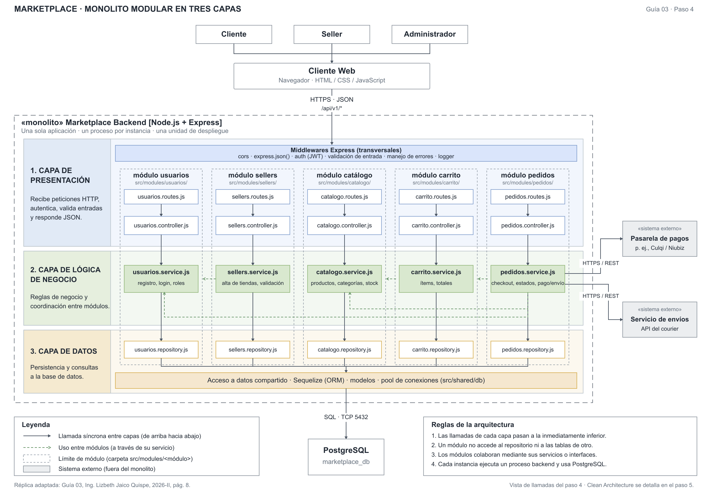

# Estilo arquitectónico del marketplace

## 1. Estilo seleccionado

Se selecciona un **monolito modular para el backend**, organizado en tres capas y comunicado con un cliente web mediante una API REST.

El backend constituye una única unidad de despliegue. En cada instancia, sus módulos se ejecutan dentro del mismo proceso y se comunican mediante servicios o interfaces internas. El cliente web, PostgreSQL y los proveedores externos se representan fuera de ese proceso.

Las funcionalidades se distribuyen en **Usuarios, Sellers, Catálogo, Carrito y Pedidos**, siguiendo las cinco columnas del gráfico de la página 8 de la guía. Pedidos coordina las integraciones de pago y envío; estas se encapsulan mediante adaptadores.

## 2. Justificación y límites

| Driver                | Respuesta de la propuesta                                                                                                                                                              |
| :-------------------- | :------------------------------------------------------------------------------------------------------------------------------------------------------------------------------------- |
| DA01 – Escalabilidad  | Posibilidad de replicar el backend completo detrás de un balanceador. Para ello se debe evitar estado de sesión exclusivo de una instancia y revisar la capacidad de la base de datos. |
| DA02 – Rendimiento    | Llamadas internas entre módulos y caché de consultas frecuentes, con validación del stock al comprar.                                                                                  |
| DA03 – Seguridad      | HTTPS y autenticación y autorización por roles en el backend.                                                                                                                          |
| DA04 – Pago externo   | Integración mediante contrato y adaptador de la pasarela, coordinada por Pedidos.                                                                                                      |
| DA05 – API REST       | El cliente web consume rutas del backend mediante HTTPS y JSON.                                                                                                                        |
| DA06 – Mantenibilidad | Responsabilidades y contratos definidos por módulo; las dependencias internas se detallarán con Clean Architecture.                                                                    |

La selección mantiene un despliegue sencillo para el alcance actual. Los microservicios añadirían coordinación distribuida y operación de múltiples servicios sin una necesidad de despliegue independiente identificada en el análisis.

La modularidad favorece el mantenimiento, pero **no produce escalabilidad automáticamente**. Todos los módulos se despliegan y escalan juntos; PostgreSQL y los servicios externos pueden limitar la capacidad del sistema. Las tácticas propuestas deberán validarse con objetivos de carga y disponibilidad cuando corresponda implementar.

## 3. Diagrama arquitectónico

El siguiente gráfico es una **réplica vectorial adaptada del ejemplo de la Guía 03, página 8**. Conserva actores, cliente web, límite del monolito, cinco módulos, tres capas, servicios externos, PostgreSQL, leyenda y reglas.

[Abrir SVG editable](./diagrama-estilo-arquitectonico.svg) · [Abrir PNG](./diagrama-estilo-arquitectonico.png) · [Abrir PDF](./diagrama-estilo-arquitectonico.pdf)

Las flechas continuas representan **llamadas durante la ejecución** y las verdes discontinuas representan colaboración entre módulos. No representan la regla de dependencias de Clean Architecture.

## 4. Componentes y responsabilidades

| Componente               | Responsabilidad                                                                                         |
| :----------------------- | :------------------------------------------------------------------------------------------------------ |
| Cliente web              | Interfaz para Cliente, Seller y Administrador. Consume la API sin conectarse directamente a PostgreSQL. |
| Presentación del backend | Rutas, controladores y middleware: recibir solicitudes, autenticar, validar entradas y responder JSON.  |
| Usuarios                 | Identidad, cuentas y roles.                                                                             |
| Sellers                  | Gestión y validación de vendedores.                                                                     |
| Catálogo                 | Consulta y gestión de productos, categorías y stock.                                                    |
| Carrito                  | Gestión de ítems y cálculo de totales.                                                                  |
| Pedidos                  | Registro y consulta de pedidos; coordinación de pago y envío mediante adaptadores.                      |
| Acceso a datos           | Repositorios y conexión a PostgreSQL. Cada módulo accede a sus datos mediante su repositorio.           |
| Pasarela de pagos        | Proveedor externo que procesa pagos.                                                                    |
| Servicio de envíos       | Proveedor externo que gestiona información de entrega.                                                  |

El gráfico reproduce Node.js, Express y Sequelize como tecnologías del ejemplo de la guía. Son referencias para comunicar la propuesta; no describen un backend ya desarrollado. PostgreSQL es una elección propuesta de persistencia, no una restricción previamente registrada.

El `boilerplate/` incorporado al repositorio es el ejemplo **Angular con adaptadores en memoria** para estudiar Clean Architecture. Su ejecución no implica que exista el backend ni la base de datos dibujados.

## 5. Reglas de organización

1. Las solicitudes entran por la presentación del backend y se delegan a la lógica correspondiente.
2. Los módulos colaboran mediante sus servicios o interfaces públicas; no acceden al repositorio ni a las tablas de otro módulo.
3. El acceso a PostgreSQL se encapsula en repositorios y componentes de persistencia.
4. Pagos y envíos se invocan mediante adaptadores del backend, sin trasladar esta responsabilidad a la base de datos.
5. Los módulos comparten una unidad de despliegue; los límites internos no los convierten en microservicios.

Ejemplo del flujo de compra: el cliente web solicita registrar un pedido; Pedidos consulta el carrito y valida productos a través de los servicios correspondientes, coordina el pago y registra el pedido mediante su repositorio. La secuencia y las reglas detalladas se desarrollarán en los casos de uso.

## 6. Alcance de esta vista y siguiente paso

ERP y facturación siguen identificados en el análisis inicial. Se omiten de esta réplica para mantener el alcance del ejemplo de la página 8; su integración y sus requisitos deberán detallarse en una vista posterior.

El monolito modular define la estructura global. **Clean Architecture**, registrada en ADR-002, define las dependencias internas del siguiente paso: Dominio, Aplicación, Presentación e Infraestructura. El dominio y los casos de uso no deben importar implementaciones de persistencia ni proveedores de pagos.

La [arquitectura inicial](./arquitectura-inicial.md) se conserva como antecedente de la Guía 02. Las [decisiones arquitectónicas](../analisis-de-sistema/07-%20decisiones-arquitect%C3%B3nicas.md) explican la selección actual.

[Continuar al paso 5: enfoque Clean Architecture](./enfoque/enfoque-arquitectonico.md).
